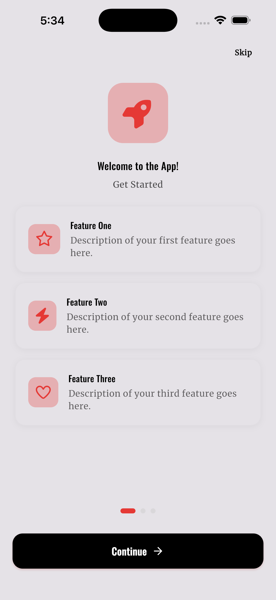
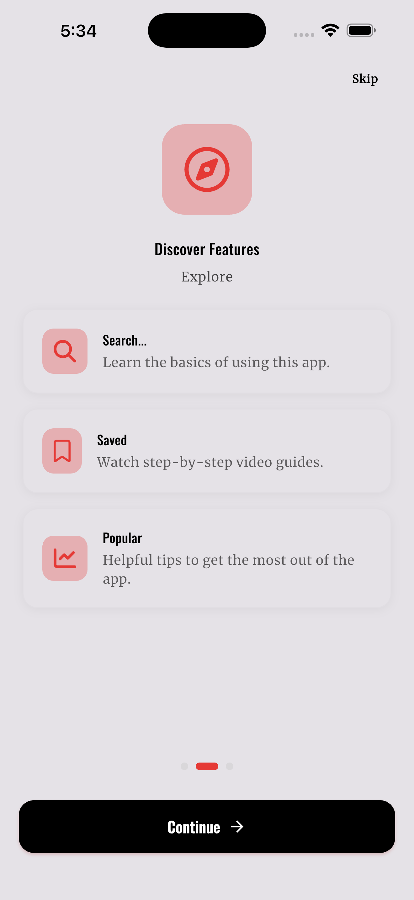
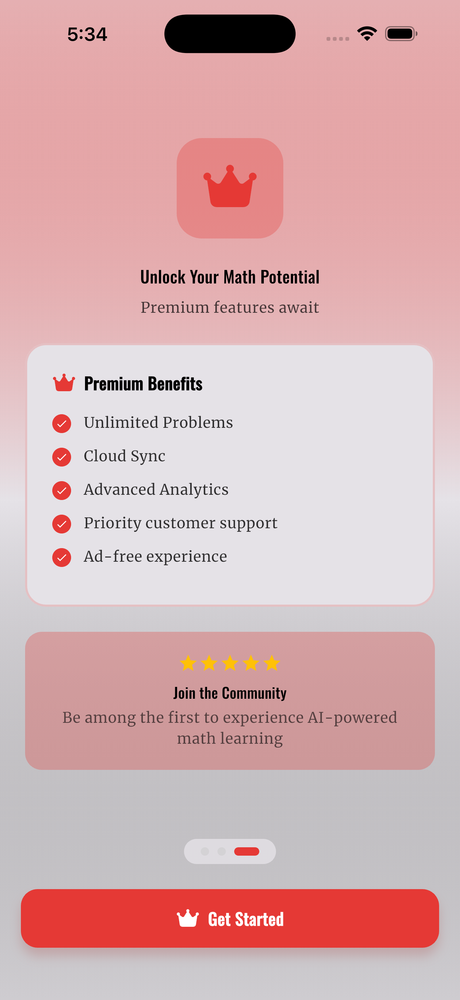
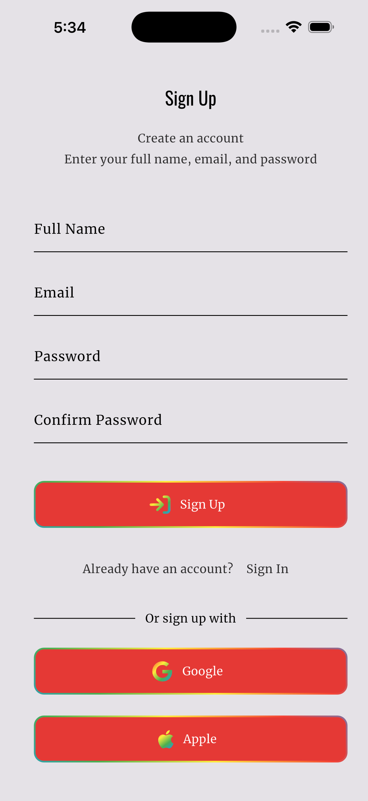
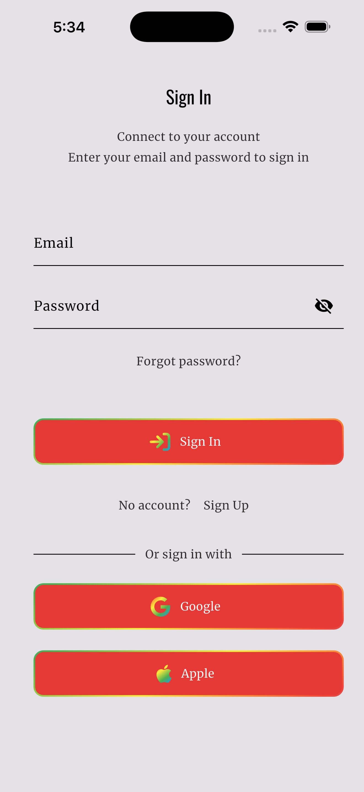
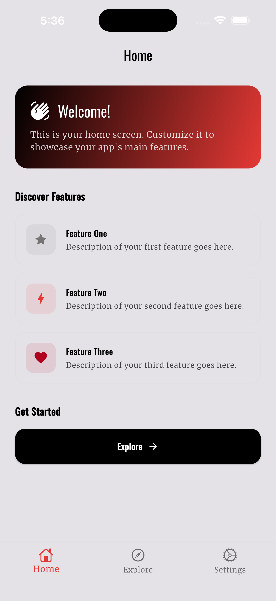
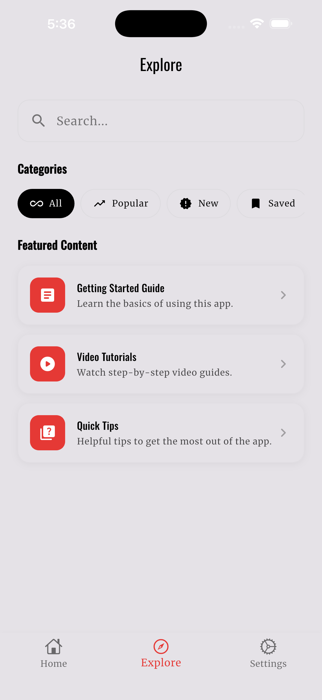
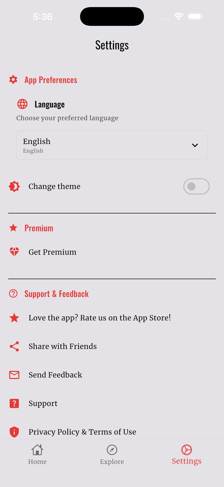

# Flutter Starter Project

A production-ready Flutter starter template with Firebase, RevenueCat subscriptions, multi-platform analytics, and more. Build your next app faster.

## Features

- **Authentication**: Google, Apple, and Email/Password sign-in
- **Subscriptions**: RevenueCat integration with paywall UI
- **Analytics**: Multi-platform tracking (Firebase, PostHog, Meta, TikTok, Tenjin)
- **AI Integration**: Firebase AI (Google Gemini) ready
- **Localization**: Multi-language support (EN, FR, ES)
- **Theme**: Dark/Light mode with persistence
- **Cloud Functions**: Webhook handlers and email automation
- **Admin Dashboard**: React admin panel for user management

## Screenshots

<p align="center">
  
  
  
  
</p>
<p align="center">
  
  
  
  
</p>

## Tech Stack

| Category | Technology |
|----------|------------|
| Frontend | Flutter (iOS, Android, Web, macOS) |
| Backend | Firebase (Auth, Firestore, Storage, Functions) |
| Admin Dashboard | React 19, Vite, TailwindCSS |
| Subscriptions | RevenueCat |
| AI | Firebase AI (Google Gemini) |
| State Management | flutter_bloc (Cubit) |
| Navigation | go_router |

## Quick Start

### 1. Clone and Rename

```bash
# Clone the repository
git clone https://github.com/your-username/flutter-starter.git my_app
cd my_app

# Install dependencies
flutter pub get

# Rename the project (preview first)
dart run scripts/rename_project.dart \
  --package-name=my_app \
  --app-name="My App" \
  --bundle-id=com.mycompany.myapp \
  --dry-run

# Apply the rename
dart run scripts/rename_project.dart \
  --package-name=my_app \
  --app-name="My App" \
  --bundle-id=com.mycompany.myapp
```

### 2. Configure Firebase (Required)

```bash
# Install FlutterFire CLI
dart pub global activate flutterfire_cli

# Configure Firebase (creates new project or links existing)
# This generates the required firebase_options.dart and platform config files
flutterfire configure
```

**Note:** The template does not include Firebase configuration files. You must run `flutterfire configure` to generate:
- `lib/firebase_options.dart`
- `android/app/google-services.json`
- `ios/Runner/GoogleService-Info.plist`

### 3. Configure Services

| Service | Configuration |
|---------|---------------|
| **RevenueCat** | Add API keys to `lib/core/config/` |
| **PostHog** | Add API key to `lib/core/config/posthog_config.dart` |
| **Meta (Facebook)** | Add App ID to `Info.plist` and `AndroidManifest.xml` |
| **TikTok** | Add App ID to config |
| **Tenjin** | Add SDK key to `lib/core/config/tenjin_config.dart` |

### 4. Run

```bash
flutter run
```

## Project Structure

```
lib/
├── core/               # Services, config, utilities
│   ├── config/         # API keys and configuration
│   └── services/       # Analytics, app services
├── features/           # Feature modules
│   ├── account/        # Authentication
│   ├── subscription/   # RevenueCat integration
│   └── ...             # Your features here
├── common_widgets/     # Reusable UI components
├── constants/          # App constants
└── l10n/              # Localization (EN, FR, ES)

functions/              # Firebase Cloud Functions
├── index.js            # Webhook handlers, email automation

dashboard/              # Admin Dashboard (React)
├── src/                # React components and pages
└── .env.example        # Firebase config template

scripts/
├── rename_project.dart # Project rename utility
```

## Analytics

Pre-configured multi-platform analytics for ad attribution and conversion tracking.

### Platforms Integrated

| Platform | Purpose | Package |
|----------|---------|---------|
| Firebase Analytics | Core analytics | `firebase_analytics` |
| PostHog | Product analytics, feature flags | `posthog_flutter` |
| Meta (Facebook) | Facebook/Instagram Ads | `facebook_app_events` |
| TikTok | TikTok Ads attribution | `tiktok_events_sdk` |
| Tenjin | Cross-platform attribution | `tenjin_plugin` |

### Events Tracked

**Acquisition**: `first_open`, `sign_up`, `login`

**Monetization**: `paywall_viewed`, `begin_checkout`, `start_trial`, `purchase`, `subscription_renewal`, `subscription_cancellation`

## Cloud Functions

RevenueCat webhooks trigger automated emails via Resend:

| Event | Email |
|-------|-------|
| New signup | Welcome email |
| Trial started | Trial welcome |
| Trial expired | Win-back offer |
| Subscription cancelled | Win-back offer |
| Billing issue | Payment reminder |

### Deploy Functions

```bash
cd functions
npm install
firebase deploy --only functions
```

Set the Resend API key:
```bash
firebase functions:secrets:set RESEND_API_KEY
```

## Admin Dashboard

A React admin panel for managing users, subscriptions, and content reports.

### Dashboard Setup

```bash
cd dashboard
npm install
cp .env.example .env
# Edit .env with your Firebase config
npm run dev
```

### Dashboard Pages

| Page | Description |
|------|-------------|
| Dashboard | Overview stats and charts |
| Users | User management |
| Subscriptions | Subscription tracking |
| Reports | Content reports moderation |
| Settings | Admin settings |

## Localization

The app supports English, French, and Spanish out of the box.

Add translations to:
- `lib/l10n/app_en.arb` (English)
- `lib/l10n/app_fr.arb` (French)
- `lib/l10n/app_es.arb` (Spanish)

Regenerate after changes:
```bash
flutter gen-l10n
```

## Project Rename Script

The rename script updates all project identifiers across platforms.

### Parameters

| Parameter | Description | Example |
|-----------|-------------|---------|
| `--package-name` | Dart package name (snake_case) | `my_app` |
| `--app-name` | Display name | `"My App"` |
| `--bundle-id` | Bundle identifier | `com.company.myapp` |
| `--dry-run` | Preview only | (flag) |

### What Gets Updated

- `pubspec.yaml` - Package name
- Android - namespace, applicationId, app label, Kotlin package
- iOS/macOS - Bundle identifiers, display names
- All Dart import statements
- Firebase config files (deleted for reconfiguration)

## Development

```bash
# Install dependencies
flutter pub get

# Run the app
flutter run

# Run tests
flutter test

# Analyze code
flutter analyze

# Build release
flutter build apk --release
flutter build ios --release
```

## Requirements

- Flutter 3.x
- Dart 3.x
- Firebase CLI
- FlutterFire CLI

## License

MIT License - see [LICENSE](LICENSE) for details.

## Contributing

Contributions are welcome! Please feel free to submit a Pull Request.
